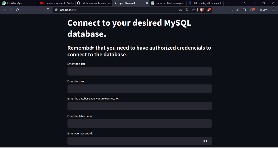

# **MySQL Database Data Entry App**

This is my first Python application. It was developed using the Streamlit package and allows data entry into tables of various MySQL databases through a user-friendly interface.

## **Table of Contents**

1. [Introduction](#Introduction)
2. [Prerequisites](#Prerequisites)
3. [Installation](#Installation)
4. [Usage](#Usage)
5. [Contribution](#Contribution)
6. [License](#License)
7. [Contact](#Contact)

<br>

# **Introduction**

Firstly, I believe it's good practice to explain who I am and the reason for creating this project. Currently, I am a Data Science undergraduate at the Federal University of Paraíba, Brazil. I am in the second semester of the course and I am interning at a consulting company. I was tasked with creating a database with all the company's contracts, which were only available in physical format. So, considering the possibility that not only I, with knowledge of SQL databases, could enter the data but anyone could, I first developed an application like this, specifically for the company's database. However, considering its limitations, I decided to develop another one that could handle any table from any MySQL database, which resulted in the project you are now reading about.

Thank you very much for your attention. I am completely open to corrections, suggestions, and advice. Enjoy the read!

<br>

# **Prerequisites**

Make sure you have the following packages installed:
````
pymysql
streamlit
pandas
````

Please note that for the application to work on your machine, you need to have a Python interpreter version 3 or higher and the MySQL components that allow interaction with databases (server and client).

### If you don't have these packages installed, i will show you how to install them after cloning the project.

<br>

# **Installation**

* **1 - Clone the repository:**

````bash
git clone https://github.com/ricktherunner/streamlit_mysql_data_entry_app
````

* **2 - Navigate to the project directory:**
bash
````bash
cd project
````
* **3 - Optionally, create a virtual environment:**

````bash
python -m venv venv
````

To activate:

````bash
.\venv\Scripts\activate
````
If your machine's operating system is Windows and you encountered permission issues while creating the environment, run this command in the terminal to unblock it:

````bash
Set-ExecutionPolicy -ExecutionPolicyRemoteSigned -Scope LocalMachine
````
Now, run the previous commands.

* **4 - Install the required packages:**
````bash
pip install -r requirements.txt
````
<br>

# **Usage:**
To run the application and enter data, execute the following command in the project directory:

````bash
python -m streamlit run app.py
````
When you run it, in a few seconds, you will be taken to a web page in your default web browser, and you will see the following page:


If you want to translate the page, right-click on a non-interactive area and select the 'Translate' option.

At this point, you should enter your database access credentials, specify it, and enter the name of the table you want to use. Press ENTER after filling in each one.

Remember that to access, your user must have permission from the database host.

Next, if the connection is successful, you will see the table columns and their specifications, and below them, input fields for each column.

After filling in the data, it will be displayed for you to confirm. If there is any mistake, go back to the input fields and make corrections. If not, click "Confirm."

After confirmation, the data will be inserted into each column, and then the updated table will appear. Scroll to find the inserted data.

If you want to continue entering data, simply change the data in the input fields without reconnecting to the database.

If you want to stop, click "Stop."

<br>

## **Link to an example video of the application in action:**

<br>



LINK: [STREAMLIT APP](https://www.youtube.com/watch?v=iTKlyRqr8zs)
<br>

# **Contribution**
You are always welcome to contribute to this project. Here are some ways to contribute:

- Report bugs or issues
- Request new features
- Submit pull requests
- Provide suggestions for updates
<br>

# **Contact**
If you have any questions or suggestions, feel free to contact me:

- Email: pedrohmvieira04@gmail.com
- Linkedin: [@pedrohmv](https://www.linkedin.com/in/pedrohmv)
- Instagram: [@pedrohmv_](https://www.instagram.com/pedrohmv_/)

Thank you very much!