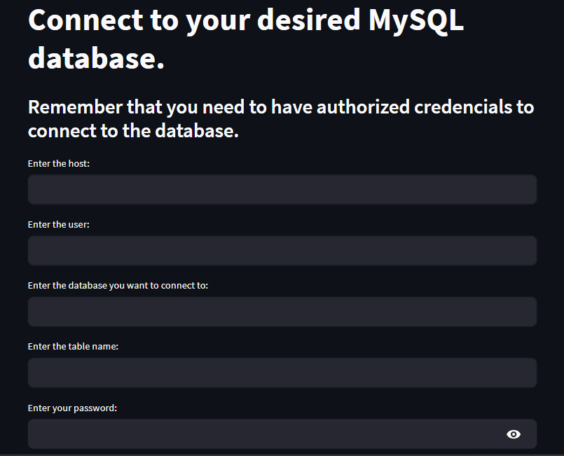
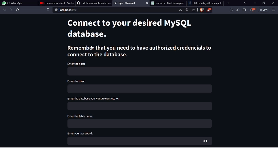

# **Aplicativo de cadastro de dados em Banco de Dados MySQL**

Este é meu primeiro aplicativo desenvolvido em Python. Ele foi desenvolvido utilizando o pacote Streamlit e permite o cadastro de dados em tabelas de diversos bancos de dados MySQL a partir de uma interface amigável ao usuário.

## **Índice**

1. [Introdução](#Introdução)
2. [Pré-requisitos](#pré-requisitos)
3. [Instalação](#instalação)
4. [Uso](#uso)
5. [Contribuição](#contribuição)
6. [Licença](#licença)
7. [Contato](#contato)

<br>

# **Introdução**

Primeiramente acredito que seja de boa prática explicar quem eu sou e motivo da criação deste projeto. Atualmente sou graduando em Ciência de Dados na Universidade Federal da Paraíba, Brasil. Estou no segundo semestre do curso e estagio em uma empresa de consultoria. Me foi demandado a construção deum banco de dados com todos os contratos da empresa, porém eles se encontravam apenas fisicamente. Portanto pensando na possibilidade de que não apenas eu, por ter conhecimento de Banco de Dados SQL, pudesse cadastrar os dados, mas qualquer um pudesse. Então, primeiramente desenvolvi um aplicativo como este, porém especificamente para o banco de dados da empresa, mas pensando em suas limitações, resolvi desenvolver outro que pudesse envolver qualquer tabela de qualquer banco de dados MySQL, o que resultou no projeto que agora você está lendo sobre.

Agradeço muito pela sua atenção, estou completamente aberto à correções, sugestões e conselhos. Boa leitura!

<br>

# **Pré-requisitos**

Certifique-se de ter os seguintes pacotes instalado:

````
pymysql
streamlit
pandas
````
Lembrando que, para que o apicativo funcione na sua máquina, você precisa ter um interpretador Python acima da versão 3, e os componentes do MySQL que permitem interações com bancos de dados (servidor e cliente).

### Caso não tenha os pacotes instalados, a seguir mostrarei como instalar todos após a clonagem do projeto.
<br>

# **Instalação**

* **1 - Clone o repositório:**

````bash
git clone https://github.com/seu-usuario/seu-projeto.git
````

*  **2 - Navegue até o diretório do projeto:**

````bash
cd projeto
````

* **3 - Caso queira, inicie um ambiente virtual:**

````bash
python -m venv venv
````
Para ativar:

````bash
.\venv\Scripts\activate
````

**Caso o sistema operacional da sua máquina seja Windows e você tenha tido problemas de permissão para criar o ambiente, execute esse comando no terminal para desbloqueá-lo:**

````bash
Set-ExecutionPolicy -ExecutionPolicyRemoteSigned -Scope LocalMachine
````

Agora execute os comandos anteriores.

* **4 - Instale os pacotes necessários:**

````bash
pip install -r requirements.txt
````
<br>

# **Uso:**

Para executar o aplicativo e inserir os dados, no diretório do projeto execute o comando:

````bash
python -m streamlit run app.py
````

Ao executar, em alguns segundos você será levado à uma página na web do seu navegador padrão e você econtrará a seguinte página:



**Caso queira traduzir a página, aperte com o boão direito e um local que não seja interativo e selecione a opção 'Traduzir'.**

Nesse momento, você deve inserir as suas credenciais de acesso a um banco de dados, ecpecificá-lo e inserir o nome da tabela que deseja usar. **Aperte _ENTER_ após preencher cada um.**

Lembre-se que para poder acessar, seu usuário deve ter a permissão do host do banco de dados.

Em seguida, caso a conexão seja sucedida, aparecerão as colunas da tabela e suas especificações, e abaixo, os inputs referentes a cada uma delas.

Após o preenchimento, os dados colocados irão aparecer para que você confirme. Caso haja algum erro, volte aos inputs e corrija. Caso não, aperte em "Confirm". 

Após a confirmação, os dados serão inseridos em cada coluna e em seguida a tabela atualizada irá aparecer. Role até achar os dados inseridos.

Caso queira continuar inserindo, é só mudar os dados dos inputs das colunas, sem precisar conectar-se ao banco de dados novamente.

Caso queira parar, aperte em "Stop".

<br>
<br>

## **Link para vídeo exemplo de funcionamento:**
<br>



### **LINK:**
* [STREAMLIT APP](https://www.youtube.com/watch?v=iTKlyRqr8zs)

<br>

# **Contribuição**

Você é sempre muito bem-vindo para contribuir para este projeto. Aqui estão algumas maneiras de contribuir:

- Relate bugs ou problemas
- Solicite novos recursos
- Envie pull requests
- Envie sugestões de atualizações

<br>

# **Contato**

Se você tiver alguma dúvida ou sugestão, sinta-se à vontade para entrar em contato:

- Email: [pedrohmvieira04@gmail.com](pedrohmvieira04@gmail.com) 
- Linkedin: [@pedrohmv](https://www.linkedin.com/in/pedrohmv)
- Instagram: [@pedrohmv_](https://www.instagram.com/pedrohmv_/)

Muito Obrigado!